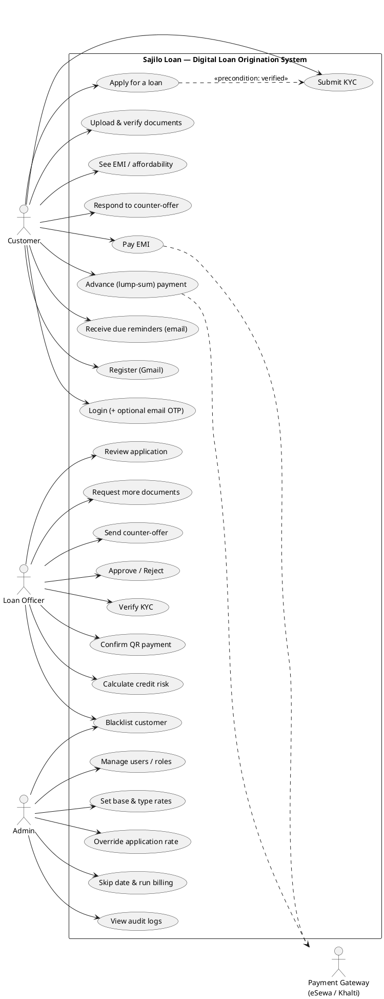
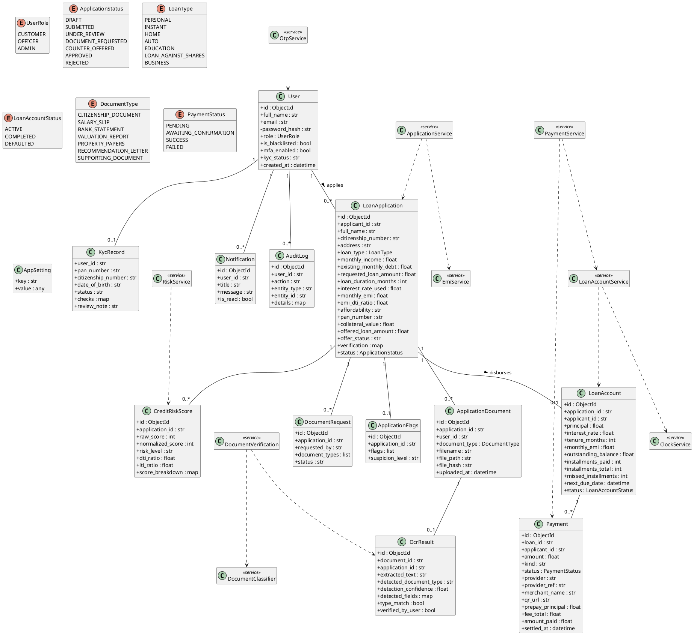
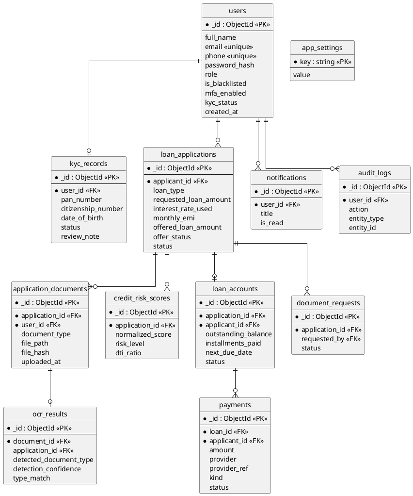
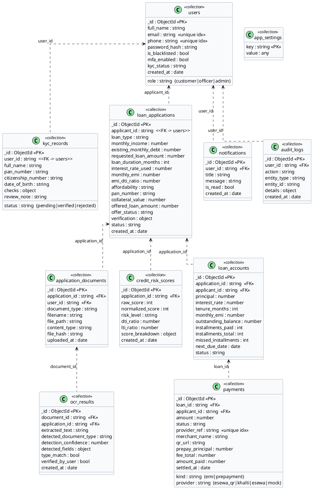
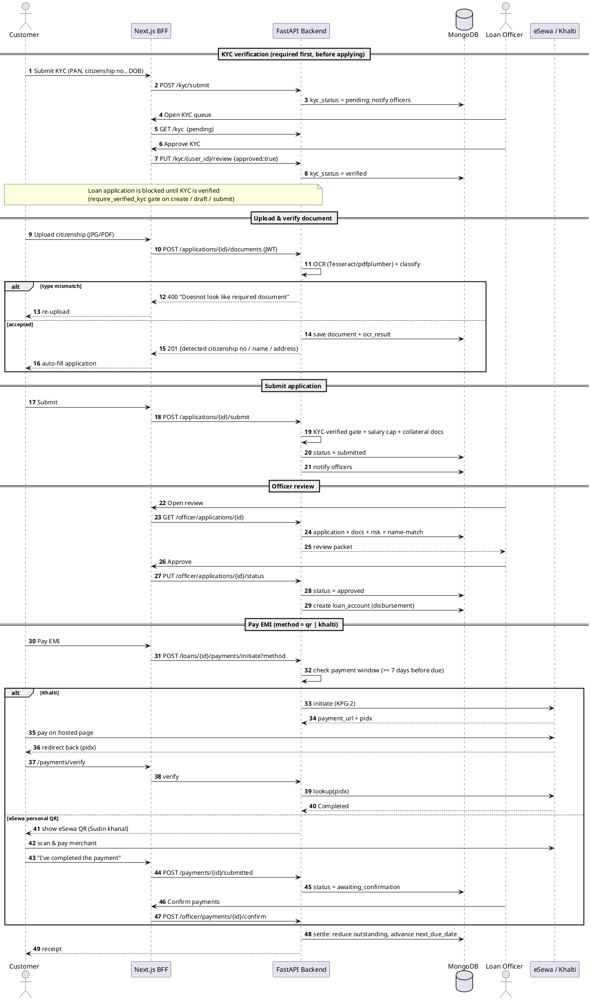
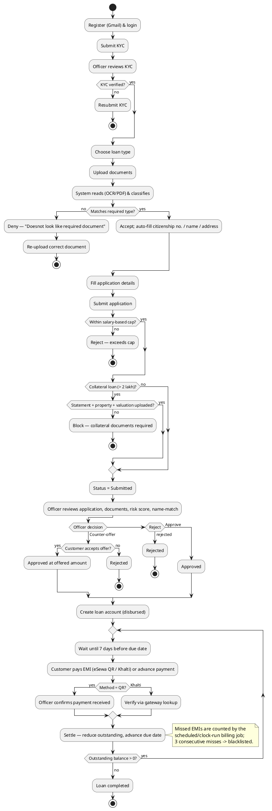

# Sajilo Loan — PlantUML Diagrams

Paste any block into [PlantText](https://www.planttext.com), [PlantUML online](https://www.plantuml.com/plantuml), or a `.puml` file. Each diagram reflects the actual system: FastAPI backend + MongoDB, Next.js BFF frontend, roles Customer / Officer / Admin, and the eSewa-QR / Khalti / eSewa payment rails.

---

## 1. Use Case Diagram

---

## 2. Class Diagram (domain + service layer)

---

## 3. ER Diagram

---

## 4. Schema Diagram (MongoDB collections with types)

---

## 5. Sequence Diagram (apply → review → approve → pay EMI)

---

## 6. Activity Diagram (loan origination + repayment)

