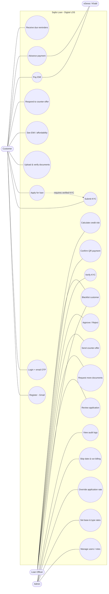
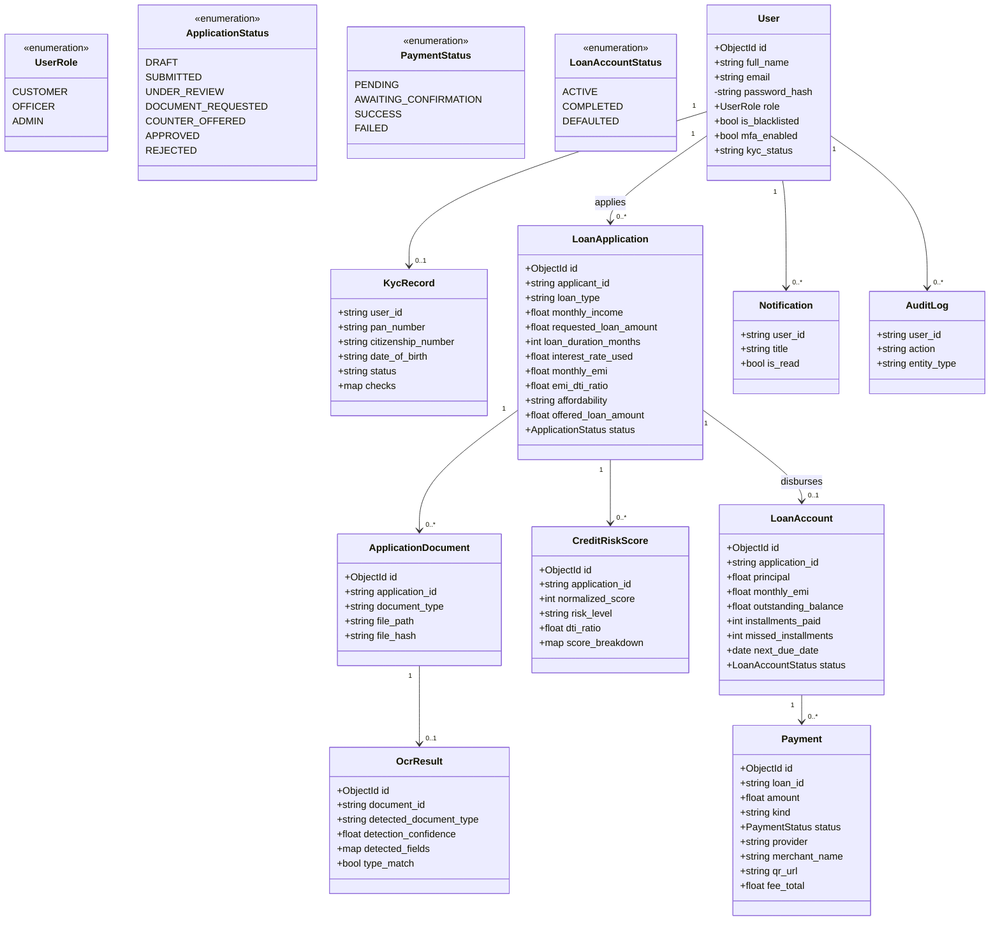
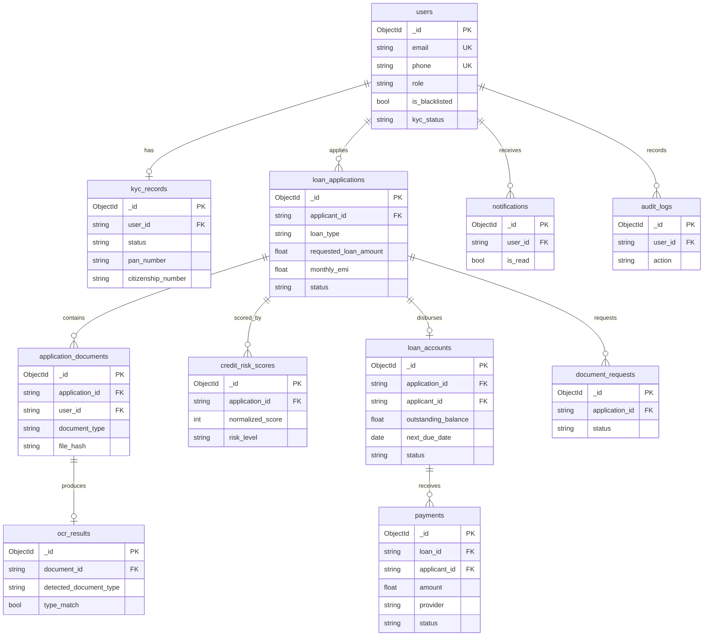
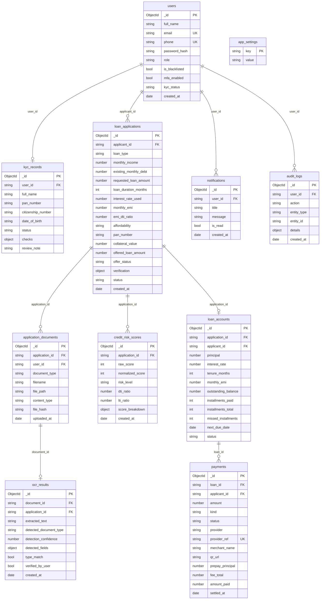
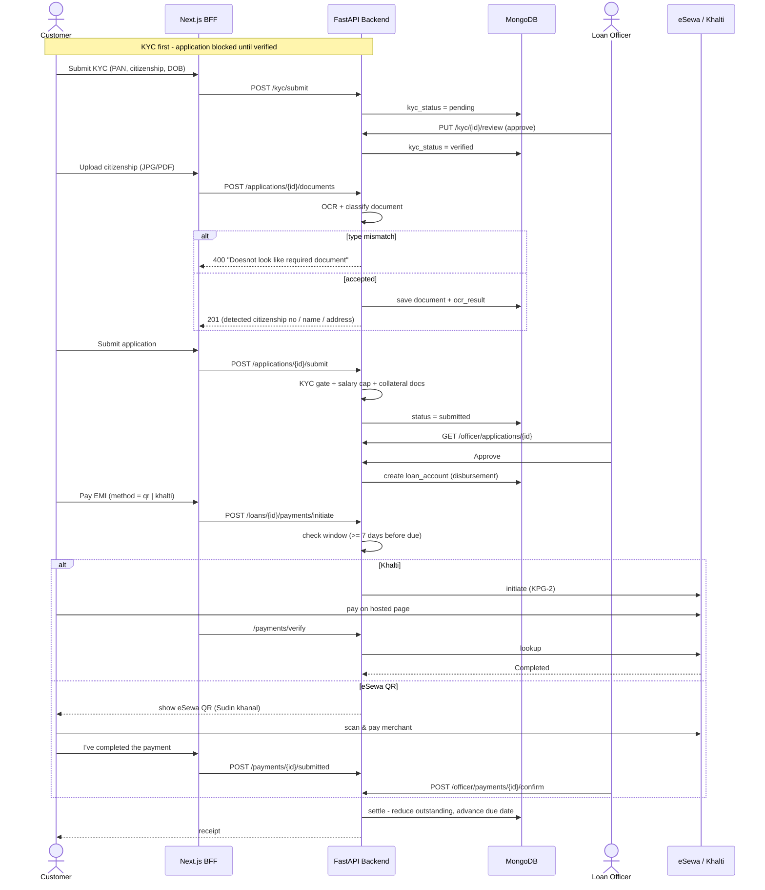
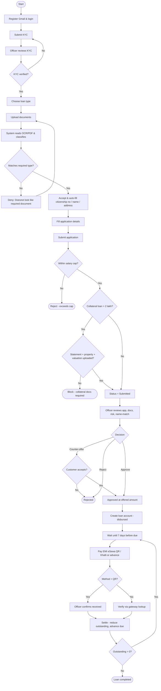

# Sajilo Loan — Diagrams for draw.io (Mermaid)

**How to use in draw.io / diagrams.net:**
1. Open draw.io → a blank diagram.
2. Click **+ (Insert)** in the top toolbar → **Advanced** → **Mermaid…**
   (or menu **Extras → Insert → Advanced → Mermaid**).
3. Paste one block below → **Insert**. It becomes editable draw.io shapes.
4. Repeat per diagram (put each on its own page/tab).

Order enforced everywhere: **register → submit KYC → officer verifies → then apply for loan**.

---

## 1. Use Case Diagram

---

## 2. Class Diagram

---

## 3. ER Diagram

---

## 4. Schema Diagram (MongoDB collections, fully typed)

---

## 5. Sequence Diagram

---

## 6. Activity Diagram

